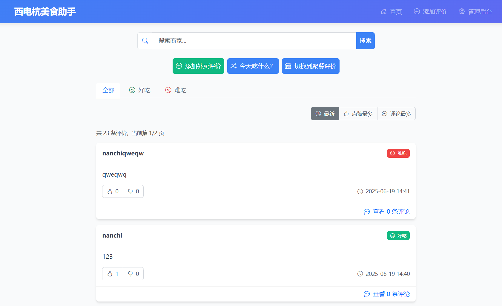

## 校园外卖助手

吃到了一次很难吃的外卖还花了好多钱，商家的评论在平台的优化下变得真真假假看不出哪个好吃哪个难吃，做一个简单的评价网站，让身边的同学一起来分享。
这是一个使用 Cursor + Claude 3.7 Sonnet 快速构建的基于 PHP 和 SQLite 的外卖评价网站，允许用户搜索商家、添加评价、评论、投票和管理。
适合在校园等交流便利，友好互助的小范围内部署使用，为方便信息传递，产品没有设计用户系统和审查系统，管理员需定期检查评价信息，可在后台进行隐藏或删除。

## 界面截图




## 功能特点

- 响应式设计，适配网页和移动端
- 搜索商家功能
- 添加评价（好吃/难吃）
- 评论系统
- 赞同/反对投票系统（基于用户UA识别）
- 后台管理系统（隐藏/显示评价）

## 技术栈

- PHP 7.4+
- SQLite 3
- Bootstrap 5
- HTML5/CSS3/JavaScript

## 项目结构

```
/
├── index.php                # 主页，显示评价列表
├── add_review.php           # 添加评价页面
├── view_review.php          # 查看评价和评论页面
├── config/
│   └── db.php               # 数据库配置
├── includes/
│   ├── functions.php        # 公共函数
│   ├── header.php           # 页面头部
│   └── footer.php           # 页面底部
├── api/
│   └── vote.php             # 投票API
├── admin/
│   └── index.php            # 后台管理页面
└── database/                # SQLite数据库文件
    └── takeout_reviews.db
```

## 安装说明

1. 确保服务器已安装PHP 7.4+和SQLite3扩展
2. 将项目文件上传到服务器
3. 确保`database`目录可写
4. 访问网站首页

## 后台管理

后台管理入口：`/admin/index.php`
默认管理员密码：`admin123`（建议在实际使用中修改）

## 注意事项

- 本项目使用SQLite数据库，无需额外的数据库服务器
- 投票系统基于用户UA和IP地址识别用户，非登录用户系统
- 在生产环境中，建议修改管理员密码并使用更安全的存储方式 